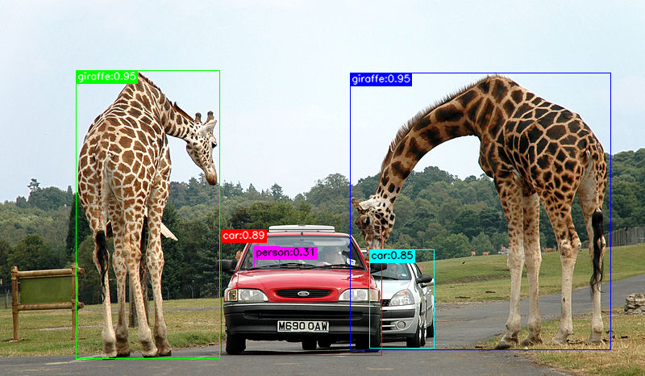
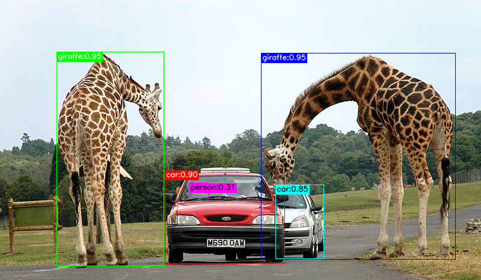
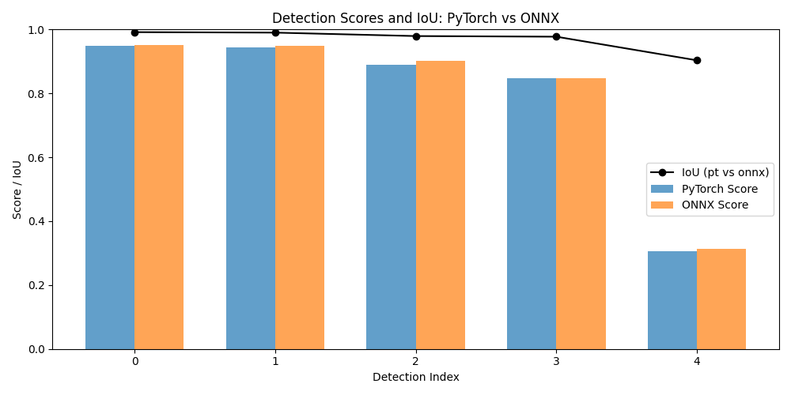

# YOLO11n-Project

YOLO11n-Project is a workflow for object detection using PyTorch and ONNX models, featuring automated inference, model conversion, and IoU analysis. The project demonstrates how to run detection on an input image, compare results between PyTorch and ONNX, and visualize detection performance.

## Features

- **PyTorch Inference:** Run object detection using a YOLO model in PyTorch.
- **ONNX Conversion & Inference:** Convert the PyTorch model to ONNX and run inference.
- **IoU Analysis:** Compare bounding boxes between PyTorch and ONNX outputs using Intersection over Union (IoU).
- **Visualization:** Save annotated images and IoU charts for easy comparison.
- **Clean, Modular Code:** Utilities and domain logic are separated for maintainability.

## Quick Start

1. **Install dependencies:**
   ```
   ./run.sh
   ```
   This script sets up the Python environment and runs the workflow.

2. **Place your input image:**
   - Put your image at `inputs/image.png`.

3. **Run the workflow:**
   ```
   ./run.sh
   ```
   Outputs will be saved in the `outputs/` directory.

## Output Files

- `outputs/pt_result.png` — PyTorch model detection result
- `outputs/onnx_result.png` — ONNX model detection result
- `outputs/iou_chart.png` — IoU comparison chart
- `outputs/summary.txt` — Detection summary
- `outputs/iou_summary.txt` — IoU scores summary

## Example Results

Below are sample screenshots generated by the workflow:

### PyTorch Detection Result



### ONNX Detection Result



### IoU Comparison Chart



## Project Structure

```
yolo11n-project/
├── inputs/              # Input images
├── models/              # Model files (.pt, .onnx)
├── outputs/             # Output images and summaries
├── screenshots/         # Example result screenshots
├── src/
│   ├── domains/         # Domain logic (DetectionDomain)
│   ├── utils/           # Utility modules (image, model, iou, viz)
│   └── main.py          # Entry point
└── README.md            # This file
```

## Customization

- To use a different image, replace `inputs/image.png`.
- To use a different YOLO model, update `models/yolo11n.pt`.
- The code is modular—extend or modify utilities and domain logic as needed.

## License

This project is provided for educational and research purposes.

---

For questions or improvements, feel free to open an issue or contribute!